# 🧠 Explainable Tabular ML Engine

## Production-Oriented Explainable Machine Learning & MLOps Platform

**End-to-End Tabular Machine Learning System with Automated Data Validation, Model Training, Hyperparameter Tuning, SHAP Explainability, MLflow Experiment Tracking, FastAPI Deployment, Docker Containerization, CI/CD Testing, and Data Drift Monitoring.**

---

## 🚀 Overview

The **Explainable Tabular ML Engine** is an end-to-end machine learning platform designed to build, evaluate, explain, deploy, and monitor machine learning models for structured/tabular data.

Unlike a traditional ML notebook that focuses only on model accuracy, this project integrates the major components required to move a machine learning workflow toward a **production-oriented MLOps architecture**.

The system uses **Telco Customer Churn** as the primary use case and predicts whether a customer is likely to churn.

The platform combines:

* 📊 Data cleaning and validation
* ⚙️ Feature engineering
* 🤖 Multiple ML model comparison
* 🔍 Hyperparameter optimization
* 📈 Model evaluation
* 🧠 SHAP explainability
* 🧪 MLflow experiment tracking
* 📦 Model versioning
* 🚀 FastAPI inference API
* 🐳 Docker containerization
* ✅ Automated API testing
* 🔄 GitHub Actions CI
* 📡 Data drift monitoring

---

# 🎯 Problem Statement

Machine learning models can achieve good predictive performance, but building a reliable ML system involves much more than training a model.

Traditional machine learning workflows often suffer from:

* Notebook-based development
* Inconsistent preprocessing
* Lack of experiment tracking
* Limited model explainability
* Manual deployment
* Lack of automated testing
* Difficult model version management
* No systematic monitoring

For example, a Random Forest model may predict that a customer is likely to churn, but a business user may also need to understand:

> **Why did the model make this prediction?**

This project addresses both sides of the problem:

### 1. Predictive Intelligence

Build and tune machine learning models that can predict customer churn.

### 2. Explainable & Operational ML

Provide feature-level explanations while integrating experiment tracking, model versioning, API deployment, testing, containerization, and basic data drift monitoring.

---

# 💡 Solution

The proposed system creates a reusable ML workflow:

```text
Raw Dataset
     │
     ▼
Data Ingestion
     │
     ▼
Data Validation
     │
     ▼
Data Cleaning
     │
     ▼
Feature Engineering
     │
     ▼
Preprocessing
     │
     ▼
Train / Test Split
     │
     ▼
Model Comparison
     │
     ▼
Hyperparameter Tuning
     │
     ▼
Model Evaluation
     │
     ├──────────────► SHAP Explainability
     │
     ▼
MLflow Tracking
     │
     ▼
Model Registry
     │
     ▼
FastAPI
     │
     ├── /predict
     │
     ├── /explain
     │
     └── /health
     │
     ▼
Docker
     │
     ▼
Deployment
     │
     ▼
Monitoring
     │
     └── Data Drift Detection
```

---

# 🏗️ System Architecture

```text
                         ┌──────────────────────┐
                         │      User / Client   │
                         └──────────┬───────────┘
                                    │
                                    ▼
                         ┌──────────────────────┐
                         │       FastAPI        │
                         │                      │
                         │  /predict            │
                         │  /explain            │
                         │  /health             │
                         └──────────┬───────────┘
                                    │
                                    ▼
                    ┌──────────────────────────────┐
                    │       ML Inference Layer     │
                    │                              │
                    │ Preprocessor → RandomForest │
                    └──────────────┬───────────────┘
                                   │
                     ┌─────────────┴─────────────┐
                     ▼                           ▼
           ┌──────────────────┐        ┌──────────────────┐
           │   Prediction     │        │ SHAP Explainer   │
           │                  │        │                  │
           │ Churn / No Churn │        │ Feature Impact   │
           └──────────────────┘        └──────────────────┘

                         Training Pipeline
                                │
                                ▼
                    ┌──────────────────────┐
                    │    Raw Tabular Data  │
                    └──────────┬───────────┘
                               ▼
                    ┌──────────────────────┐
                    │ Validation / Cleaning│
                    └──────────┬───────────┘
                               ▼
                    ┌──────────────────────┐
                    │ Feature Engineering  │
                    └──────────┬───────────┘
                               ▼
                    ┌──────────────────────┐
                    │   Preprocessing      │
                    └──────────┬───────────┘
                               ▼
                    ┌──────────────────────┐
                    │ Model Training       │
                    │ LR / DT / RF /       │
                    │ XGBoost / SVM        │
                    └──────────┬───────────┘
                               ▼
                    ┌──────────────────────┐
                    │ Model Evaluation     │
                    └──────────┬───────────┘
                               ▼
                    ┌──────────────────────┐
                    │ MLflow Tracking      │
                    │ + Model Registry     │
                    └──────────────────────┘

                    Monitoring Pipeline
                               │
              ┌────────────────┴────────────────┐
              ▼                                 ▼
       Reference Data                     Current Data
              │                                 │
              └──────────────┬──────────────────┘
                             ▼
                    ┌──────────────────┐
                    │ KS-Test Drift    │
                    │ Detection        │
                    └────────┬─────────┘
                             ▼
                    ┌──────────────────┐
                    │ Drift Report     │
                    └──────────────────┘
```

---

# 🔥 Key Features

## 📊 1. Data Validation & Cleaning

The pipeline validates and cleans the raw Telco Customer Churn dataset.

Implemented operations include:

* Missing value handling
* Duplicate detection
* Numeric conversion
* Data type handling
* Dataset shape validation
* Target encoding

Example:

```python
df_clean["TotalCharges"] = pd.to_numeric(
    df_clean["TotalCharges"],
    errors="coerce"
)

df_clean["TotalCharges"] = (
    df_clean["TotalCharges"].fillna(0)
)

df_clean = df_clean.drop_duplicates()
```

### Final Cleaning Checkpoint

```text
Shape:              (7021, 20)
Missing Values:     0
Duplicate Rows:     0
```

---

# ⚙️ 2. Feature Engineering

Additional features were created to provide useful information to the model.

### Average Monthly Spend

```python
AverageMonthlySpend =
TotalCharges / tenure
```

### New Customer Indicator

```python
IsNewCustomer =
tenure <= 3
```

### Long-Term Contract Indicator

```python
HasLongTermContract =
Contract != "Month-to-month"
```

These features help represent customer behavior in a form that machine learning models can use.

---

# 🤖 3. Model Comparison

Multiple classification algorithms were evaluated:

| Model               | Purpose                              |
| ------------------- | ------------------------------------ |
| Logistic Regression | Baseline linear model                |
| Decision Tree       | Interpretable tree-based model       |
| Random Forest       | Ensemble tree model                  |
| XGBoost             | Gradient boosting model              |
| SVM                 | Non-linear classification comparison |

The models were evaluated using metrics such as:

* Accuracy
* Precision
* Recall
* F1-score
* ROC-AUC

The **Random Forest** model was selected as the primary model based on the evaluation workflow.

---

# 🎯 4. Hyperparameter Optimization

Random Forest hyperparameters were optimized using:

```text
RandomizedSearchCV
```

with:

```text
5-Fold Cross Validation
```

The search explored parameters including:

* `n_estimators`
* `max_depth`
* `min_samples_split`
* `min_samples_leaf`
* `max_features`
* `class_weight`

Example:

```python
RandomizedSearchCV(
    estimator=rf,
    param_distributions=param_dist,
    n_iter=30,
    scoring="f1",
    cv=5,
    random_state=42,
    n_jobs=-1
)
```

This allows the model configuration to be selected systematically rather than manually.

---

# 📈 5. Model Evaluation

The final evaluation was performed on a held-out test set containing:

```text
1,405 samples
```

Example evaluation output:

```text
                 Precision    Recall    F1-Score

No Churn            0.88       0.81       0.84
Churn               0.57       0.70       0.63

Accuracy                                  0.78
```

For the churn class:

```text
Recall : 0.70
F1     : 0.63
```

The evaluation demonstrates that the model can identify a meaningful portion of customers belonging to the churn class while maintaining overall classification performance.

---

# 🧠 6. SHAP Explainability

A major component of this project is **model explainability**.

The project uses:

```text
SHAP
```

to understand how individual features influence model predictions.

Instead of returning only:

```text
Prediction = Churn
```

the system can provide:

```text
Prediction = Churn

Feature Contributions:
tenure
Contract
HasLongTermContract
InternetService
TotalCharges
OnlineSecurity
TechSupport
PaymentMethod
MonthlyCharges
...
```

### Example Prediction

```json
{
  "prediction": "Churn",
  "churn_probability": 0.8672
}
```

The model estimated:

```text
Churn Probability = 86.72%
```

### Example SHAP Explanation

```text
Feature                         SHAP Value

tenure                          +0.0586
Contract_Month-to-month         +0.0457
HasLongTermContract             +0.0390
InternetService_Fiber optic     +0.0389
TotalCharges                    +0.0236
OnlineSecurity_No               +0.0225
TechSupport_No                  +0.0211
PaymentMethod_Electronic check  +0.0201
InternetService_DSL             +0.0198
MonthlyCharges                  +0.0158
```

Positive SHAP values in this explanation indicate that the feature contributed toward the model's **Churn** output.

> SHAP values explain the model's prediction. They should not be interpreted as proof that a feature causally caused customer churn.

---

# 🔬 Local Explainability API

The `/explain` endpoint provides:

```text
Prediction
      +
Probability
      +
Top Feature Contributions
```

Example:

```json
{
  "prediction": "Churn",
  "churn_probability": 0.8672,
  "top_features": [
    {
      "feature": "num__tenure",
      "shap_value": 0.0586,
      "importance": 0.0586
    },
    {
      "feature": "cat__Contract_Month-to-month",
      "shap_value": 0.0457,
      "importance": 0.0457
    }
  ]
}
```

---

# 📦 7. MLflow Experiment Tracking

The project uses **MLflow** for experiment tracking and model lifecycle management.

MLflow records:

* Model parameters
* Evaluation metrics
* Model artifacts
* Experiment runs
* SHAP artifacts
* Model versions

Experiment:

```text
Telco_Customer_Churn
```

Model:

```text
TelcoChurnRandomForest
```

Registered version:

```text
Version 1
```

Example tracked run:

```text
RandomForest_Tuned
```

This makes it possible to compare experiments and maintain a record of trained models.

---

# 🗂️ 8. Model Registry

The trained Random Forest model was registered in MLflow as:

```text
TelcoChurnRandomForest
```

Version:

```text
v1
```

The registry provides a centralized location for model versions and supports a more structured ML lifecycle.

---

# 🚀 9. FastAPI Deployment

The trained model is exposed through a REST API using **FastAPI**.

### Available Endpoints

| Endpoint   | Method | Purpose                                |
| ---------- | ------ | -------------------------------------- |
| `/`        | GET    | API information                        |
| `/health`  | GET    | Health check                           |
| `/predict` | POST   | Generate prediction                    |
| `/explain` | POST   | Generate prediction + SHAP explanation |

---

## `/health`

```json
{
  "status": "healthy"
}
```

---

## `/predict`

Input:

```json
{
  "gender": "Female",
  "SeniorCitizen": 0,
  "Partner": "Yes",
  "Dependents": "No",
  "tenure": 5,
  "PhoneService": "Yes",
  "MultipleLines": "No",
  "InternetService": "Fiber optic",
  "OnlineSecurity": "No",
  "OnlineBackup": "No",
  "DeviceProtection": "No",
  "TechSupport": "No",
  "StreamingTV": "Yes",
  "StreamingMovies": "Yes",
  "Contract": "Month-to-month",
  "PaperlessBilling": "Yes",
  "PaymentMethod": "Electronic check",
  "MonthlyCharges": 90.0,
  "TotalCharges": 450.0,
  "AverageMonthlySpend": 90.0,
  "IsNewCustomer": 0,
  "HasLongTermContract": 0
}
```

Output:

```json
{
  "prediction": "Churn",
  "churn_probability": 0.8672
}
```

---

# 🐳 10. Docker Containerization

The FastAPI application is containerized using Docker.

### Docker Architecture

```text
Docker Image
     │
     ├── Python 3.12
     ├── FastAPI
     ├── Uvicorn
     ├── Scikit-learn
     ├── SHAP
     ├── Pandas
     └── Trained Model
            │
            ▼
       Docker Container
            │
            ▼
       Port 8000
            │
            ▼
       FastAPI API
```

The container exposes:

```text
8000
```

Health endpoint:

```text
GET /health
```

Example:

```json
{
  "status": "healthy"
}
```

---

# 🧪 11. Automated Testing

The project includes API tests for:

```text
/health
/predict
/explain
```

Local test result:

```text
3 passed
```

Example:

```text
tests/test_api.py

✓ test_health
✓ test_predict
✓ test_explain

3 passed
```

---

# 🔄 12. CI with GitHub Actions

GitHub Actions automatically runs the test suite when code is pushed to the repository or a pull request is created.

### CI Pipeline

```text
Developer Push
      │
      ▼
GitHub Repository
      │
      ▼
GitHub Actions
      │
      ├── Checkout Code
      │
      ├── Setup Python 3.12
      │
      ├── Install Dependencies
      │
      └── Run Pytest
              │
              ▼
          3 Tests
              │
              ▼
          PASS ✅
```

Latest successful test execution:

```text
3 passed
```

This prevents basic API regressions from being merged unnoticed.

---

# 📡 13. Data Drift Monitoring

The project includes a basic data drift monitoring pipeline.

Reference data and current data are compared using the:

```text
Kolmogorov-Smirnov (KS) Test
```

Monitored numerical features:

```text
tenure
MonthlyCharges
TotalCharges
AverageMonthlySpend
```

### Drift Rule

```text
p-value < 0.05
        ↓
Drift Detected
```

### Demonstration Result

```text
Feature                 p-value     Drift

tenure                  0.9106      False
MonthlyCharges          0.3498      False
TotalCharges            0.9231      False
AverageMonthlySpend     0.2920      False
```

The demonstration did not detect statistically significant drift at:

```text
α = 0.05
```

> The current monitoring dataset is created from different portions of the same source dataset, so this demonstrates the monitoring mechanism rather than representing genuine production-time drift.

---

# 🛠️ Technology Stack

## Machine Learning

```text
Python
Pandas
NumPy
Scikit-learn
XGBoost
SHAP
SciPy
```

## MLOps

```text
MLflow
Model Registry
Experiment Tracking
Model Artifacts
Data Drift Detection
```

## API & Deployment

```text
FastAPI
Uvicorn
Docker
```

## Testing & CI/CD

```text
Pytest
GitHub Actions
```

## Development

```text
Jupyter Notebook
VS Code
Git
GitHub
```

---

# 📁 Project Structure

```text
explainable-tabular-ml-engine/
│
├── data/
│   ├── raw/
│   └── processed/
│
├── notebooks/
│
├── src/
│   ├── data/
│   │   ├── ingestion.py
│   │   └── validation.py
│   │
│   ├── features/
│   │   └── preprocessing.py
│   │
│   ├── models/
│   │   ├── train.py
│   │   ├── evaluate.py
│   │   └── predict.py
│   │
│   ├── explainability/
│   │   └── shap_explainer.py
│   │
│   └── utils/
│
├── models/
│   ├── random_forest_churn.pkl
│   ├── preprocessor.pkl
│   └── shap_feature_importance.csv
│
├── api/
│   ├── __init__.py
│   ├── main.py
│   ├── schemas.py
│   └── routes.py
│
├── scripts/
│   ├── create_monitoring_data.py
│   └── drift_monitor.py
│
├── tests/
│   └── test_api.py
│
├── configs/
│   └── config.yaml
│
├── .github/
│   └── workflows/
│       └── ci.yml
│
├── Dockerfile
├── .dockerignore
├── .gitignore
├── requirements.txt
├── dvc.yaml
└── README.md
```

---

# 🔧 Installation

## 1. Clone Repository

```bash
git clone https://github.com/vummidiganesh55/explainable-tabular-ml-engine.git
```

```bash
cd explainable-tabular-ml-engine
```

---

# 🐍 2. Create Virtual Environment

Windows:

```bash
python -m venv .venv
```

Activate:

```bash
.venv\Scripts\activate
```

---

# 📦 3. Install Dependencies

```bash
pip install -r requirements.txt
```

---

# 🚀 4. Run FastAPI

```bash
uvicorn api.main:app --reload
```

Open:

```text
http://127.0.0.1:8000/docs
```

FastAPI Swagger UI:

```text
http://127.0.0.1:8000/docs
```

---

# 🐳 Run with Docker

Build the image:

```bash
docker build -t explainable-tabular-ml-engine .
```

Run the container:

```bash
docker run -p 8000:8000 explainable-tabular-ml-engine
```

Check:

```text
http://localhost:8000/health
```

Expected:

```json
{
  "status": "healthy"
}
```

---

# 🧪 Run Tests

```bash
pytest
```

Expected:

```text
3 passed
```

---

# 📊 MLflow

Start MLflow:

```bash
mlflow server --host 127.0.0.1 --port 5000
```

Open:

```text
http://127.0.0.1:5000
```

The MLflow dashboard can be used to inspect:

* Experiments
* Runs
* Parameters
* Metrics
* Artifacts
* Registered models

---

# 📡 Run Drift Monitoring

Generate monitoring datasets:

```bash
python scripts/create_monitoring_data.py
```

Run drift detection:

```bash
python scripts/drift_monitor.py
```

Output:

```text
=== DATA DRIFT REPORT ===
```

The generated report is:

```text
data/processed/drift_report.csv
```

---

# 📸 Project Screenshots

## 1. Data Cleaning & Validation

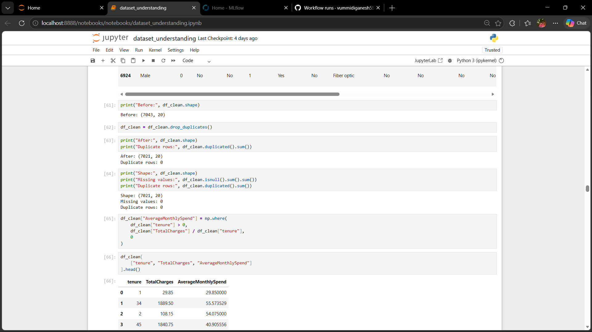

---

## 2. Model Comparison

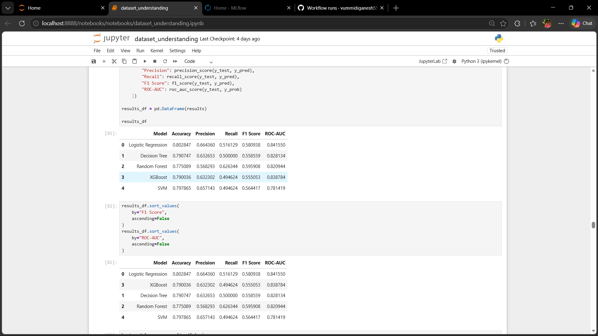

---

## 3. Model Evaluation

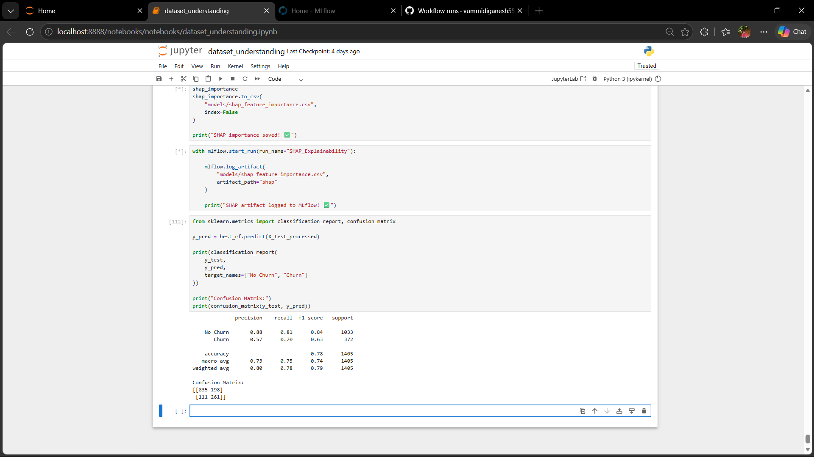

---

## 4. SHAP Explainability

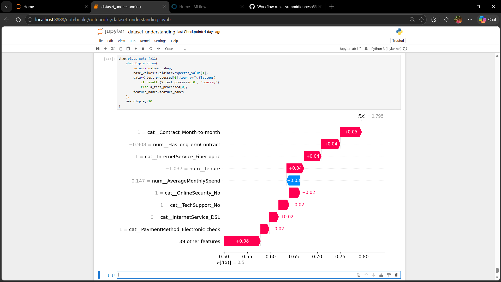

---

## 5. SHAP Feature Importance

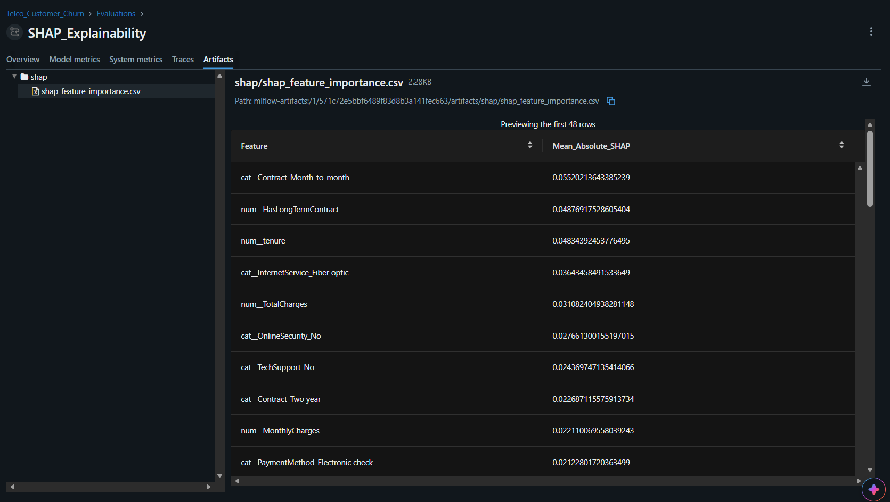

---

## 6. MLflow Experiment Tracking

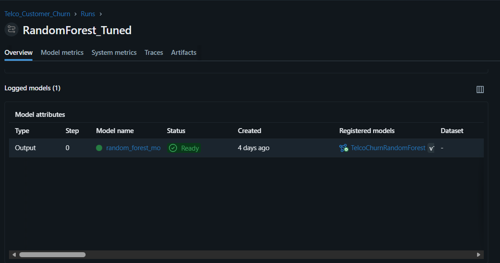

---

## 7. MLflow Model Registry

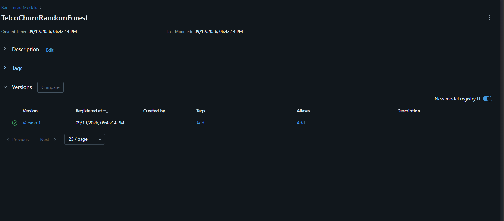

---

## 8. FastAPI Prediction

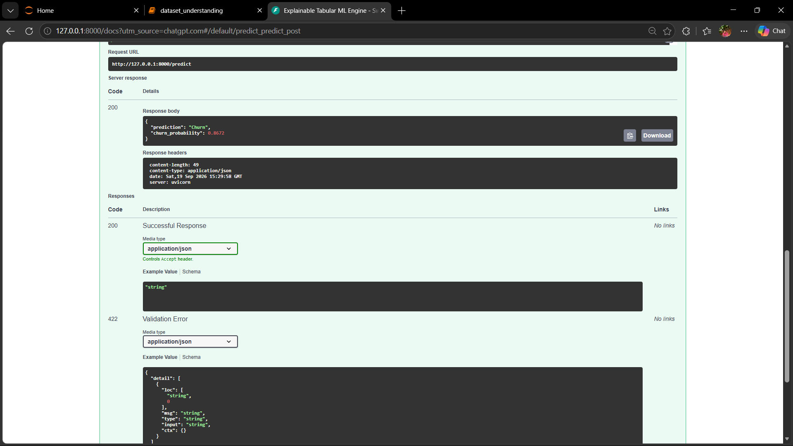

---

## 9. FastAPI Explainability

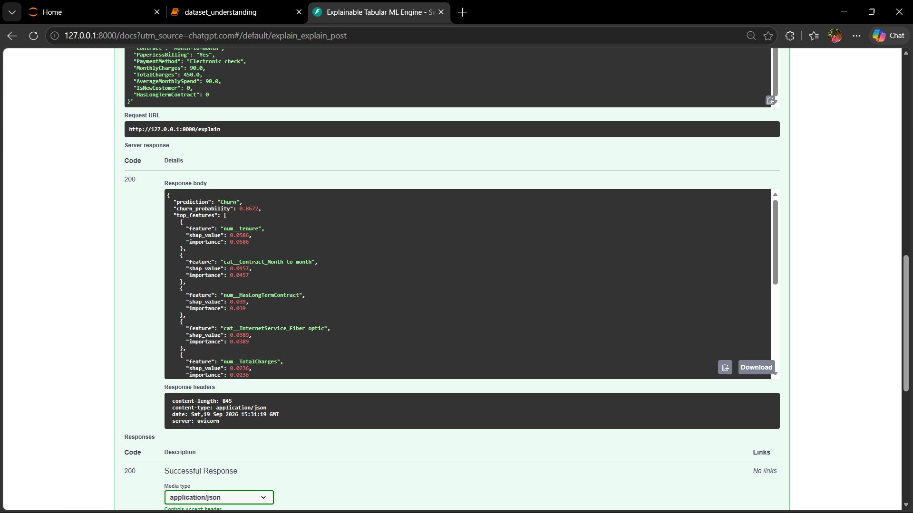

---

## 10. Docker Deployment

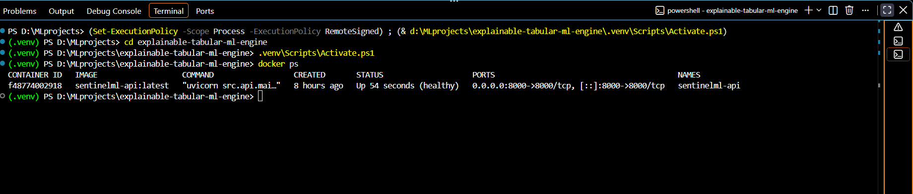

---

## 11. GitHub Actions CI

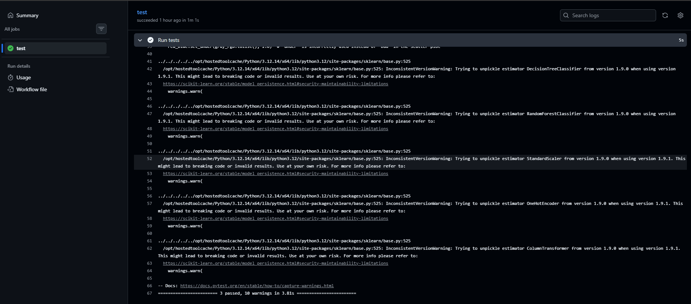

---

## 12. Data Drift Monitoring

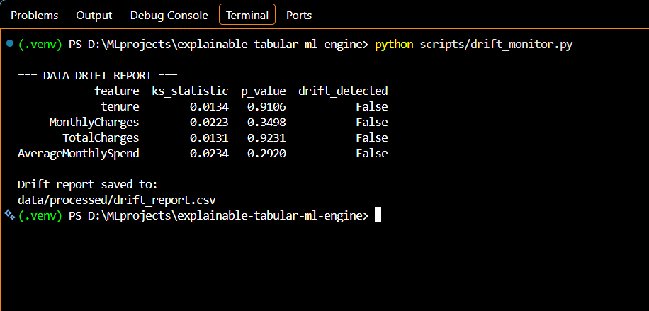

---

# 📈 Project Results

| Component                 | Result               |
| ------------------------- | -------------------- |
| Dataset                   | Telco Customer Churn |
| Cleaned Dataset           | 7,021 rows           |
| Missing Values            | 0                    |
| Duplicate Rows            | 0                    |
| Test Samples              | 1,405                |
| Primary Model             | Random Forest        |
| Churn Recall              | 0.70                 |
| Churn F1-score            | 0.63                 |
| Overall Accuracy          | 0.78                 |
| Example Churn Probability | 86.72%               |
| SHAP                      | Implemented          |
| MLflow Tracking           | Implemented          |
| Model Registry            | Implemented          |
| FastAPI                   | Implemented          |
| Docker                    | Implemented          |
| Automated Tests           | 3 passed             |
| GitHub Actions            | Implemented          |
| Drift Monitoring          | Implemented          |

---

# 🔐 Engineering Considerations

The project follows several practical ML engineering principles:

### Consistent preprocessing

The same fitted preprocessing pipeline is reused during inference.

### Unknown category handling

```python
OneHotEncoder(handle_unknown="ignore")
```

helps prevent inference failures when an unseen categorical value is received.

### Model artifact persistence

The trained model and preprocessing pipeline are stored as reusable artifacts.

### API health check

The `/health` endpoint provides a basic service health check.

### Automated testing

API endpoints are tested automatically.

### Experiment tracking

MLflow provides traceability for experiments and model artifacts.

### Explainability

SHAP provides local feature-level explanations for predictions.

---

# ⚠️ Current Limitations

This project is **production-oriented**, but it is not presented as a fully enterprise production system.

Current limitations include:

* Authentication and authorization are not implemented.
* No database-backed prediction logging.
* No centralized observability stack.
* No Kubernetes deployment.
* No cloud deployment.
* Monitoring is currently batch-based.
* Drift monitoring uses a demonstration reference/current split.
* Model retraining is not automatically triggered by drift.
* API input validation can be further strengthened using dedicated Pydantic schemas.
* Dependency versions should be pinned exactly to avoid serialized-model compatibility warnings.

---

# 🚀 Future Improvements

The platform can be extended with:

```text
                    Current System
                          │
          ┌───────────────┼────────────────┐
          ▼               ▼                ▼
     Cloud Deploy    Advanced Monitor   Security
          │               │                │
          ▼               ▼                ▼
       AWS/Azure      Prometheus       OAuth/JWT
          │           Grafana           RBAC
          │               │
          └───────────────┼────────────────┘
                          ▼
                   Automated Retraining
                          │
                          ▼
                    Model Validation
                          │
                          ▼
                    Model Registry
                          │
                          ▼
                    Production Model
```

Potential extensions:

* Automated model retraining
* Feature store integration
* Prometheus/Grafana monitoring
* Cloud deployment
* Kubernetes
* Model performance monitoring
* Prediction logging
* Authentication and RBAC
* Automated rollback
* Model approval workflows
* CI/CD model deployment
* Automated drift-triggered retraining
* Multi-dataset support
* Regression model support
* Model performance dashboards

---

# 🎓 What I Learned

This project provided hands-on experience with the complete ML lifecycle:

```text
Data
 ↓
Cleaning
 ↓
Feature Engineering
 ↓
Model Training
 ↓
Evaluation
 ↓
Explainability
 ↓
Experiment Tracking
 ↓
Model Registry
 ↓
API
 ↓
Docker
 ↓
Testing
 ↓
CI/CD
 ↓
Monitoring
```

Key engineering lessons include:

* Why preprocessing must be consistent between training and inference
* How to compare machine learning algorithms
* How cross-validation and hyperparameter tuning improve model selection
* How SHAP explains individual predictions
* How MLflow tracks experiments and model artifacts
* How FastAPI exposes ML models as APIs
* How Docker packages ML applications
* How automated testing protects API functionality
* How GitHub Actions automates testing
* How statistical tests can be used for basic data drift detection

---

# 💼 Business Use Case

The same architecture can be adapted to different tabular ML problems.

### Customer Analytics

```text
Customer Data
     ↓
Churn Prediction
     ↓
Risk Explanation
     ↓
Retention Strategy
```

### Fraud Detection

```text
Transaction Data
     ↓
Fraud Prediction
     ↓
Risk Score
     ↓
Feature Explanation
```

### Predictive Maintenance

```text
Sensor Data
     ↓
Failure Prediction
     ↓
Feature Contribution
     ↓
Maintenance Decision
```

### Credit Risk

```text
Customer Financial Data
     ↓
Risk Prediction
     ↓
Probability
     ↓
Explainable Decision Support
```

---

# 🧠 Why Explainability Matters

A machine learning prediction without an explanation can be difficult for users to trust or investigate.

For example:

```text
Traditional ML API

Customer
   ↓
Model
   ↓
"Churn"
```

With explainability:

```text
Customer
   ↓
Model
   ↓
"Churn — 86.72%"
   ↓
Why?
   ├── Short tenure
   ├── Month-to-month contract
   ├── Fiber optic service
   ├── No online security
   └── Electronic check payment
```

This makes the output easier to inspect and debug.

---

# 🏆 Project Highlights

```text
✅ End-to-End ML Pipeline
✅ Multiple Model Comparison
✅ Random Forest Hyperparameter Tuning
✅ SHAP Local Explainability
✅ MLflow Experiment Tracking
✅ MLflow Model Registry
✅ FastAPI Prediction API
✅ FastAPI Explainability API
✅ Docker Containerization
✅ Automated API Testing
✅ GitHub Actions CI
✅ Data Drift Monitoring
```

---

# 📚 References

### SHAP

Lundberg, S. M., & Lee, S.-I.
**A Unified Approach to Interpreting Model Predictions.**
NeurIPS, 2017.

### MLflow

Zaharia, M. et al.
**Accelerating the Machine Learning Lifecycle with MLflow.**
IEEE Data Engineering Bulletin, 2018.

### Machine Learning Technical Debt

Sculley, D. et al.
**Hidden Technical Debt in Machine Learning Systems.**
NeurIPS, 2015.

---

# 👨‍💻 Author

**Ganesh Sai**

Computer Science Graduate | Machine Learning | MLOps | AI Engineering

---

# ⭐ If You Find This Project Useful

If this project demonstrates useful ideas around **Explainable AI, Machine Learning, and MLOps**, consider giving the repository a ⭐.

---

## 🔗 Repository

**GitHub:**
https://github.com/vummidiganesh55/explainable-tabular-ml-engine
